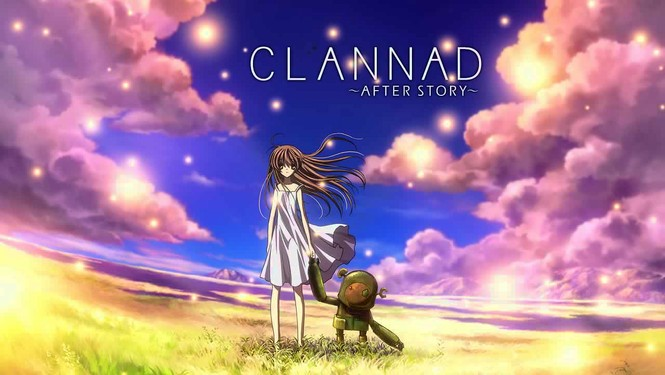

# Project README – Audio-Reactive “Wheel of Fortune” Visualisation

---

## How to run and interact

1. **Open the folder in Visual Studio Code**
2. Right‑click `index.html` → **“Open with Live Server.”**
3. Page opens full‑screen; music is paused at first load.
4. Click **Play / Pause** (top‑left).
5. While the track plays, observe how

   * softly glowing **blobs** breathe in and out,
   * **radiant** spokes rotate and pulse,
   * drifting **sparks** leave faint tails,
   * brief **flashes** appear on every accented beat.

(All visuals rescale automatically to fit any window while keeping a 1 : 1 composition.)

---

## Individual approach – why audio?

I chose the track **“Town, Flow of Time, People”** from the animation Clannad to reflect the cyclical nature of the chosen artwork. Its slow tempo, soft harp, woodwinds, and ambient textures mirror the passage of time and the quiet rhythm of fate. The music evokes a sense of stillness and continuity—where towns fade, people change, yet life quietly endures and returns.

By pairing this track with motion, the digital canvas gains emotional depth: the wheel turns, elements rise and fade, and the whole scene *breathes* in sync with its theme of *Wheels of Fortune*.

---

## Multi‑layer animation & audio mapping

| Layer         | Audio input (p5.FFT / helpers)                       | Behaviour (per frame)                                      | Conceptual link                    |
| ------------- | ---------------------------------------------------- | ---------------------------------------------------------- | ---------------------------------- |
| **NoiseBlob** | Mid‑band energy (200 – 2 000 Hz) & spectral centroid | Radius scales 0.8–1.2 ×; hue shifts dusk‑gold → pale light | Living cells riding fortune’s tide |
| **Radiant**   | Spectral centroid                                    | Rotation 0.1–4 ×; ray length & core pulse vary             | Wheel spokes of destiny            |
| **Spark**     | Overall amplitude                                    | Spawn rate, size, tail length rise on loud peaks           | Fleeting strokes of luck           |
| **Flash**     | PeakDetect on 200 – 2 000 Hz                         | One‑frame white overlay on each strong beat                | Sudden twists of fate              |
| **Canvas**    | `windowResized()` event                              | Uniform scale & centring via `calculateScale()`            | Fate’s wheel always centred        |

---

## Technical implementation

* **Layered canvases** – `createGraphics()` draws a grainy background texture on a hidden buffer, then blends it over the main canvas.
* **Additive glow** – `drawingContext.globalCompositeOperation = "lighter"` is toggled for deep elements to achieve realistic light bloom.
* **Responsive full‑screen** – `calculateScale()` finds the larger ratio of `windowWidth / 900` or `windowHeight / 900`, applies a uniform `scale()`, and stores `offsetX / offsetY` for centred drawing.
* **Audio pipeline** – `p5.FFT`, `Amplitude`, and `PeakDetect` run each frame; their outputs are linearly mapped to size, hue, rotation, spawn probability, and flash alpha.
* **Tempo‑noise blend** – During quiet passages, motion falls back to smooth `frameCount`‑driven `sin()` and Perlin `noise()` values so that the scene never freezes.
* **Modular classes** – `NoiseBlob`, `Radiant`, `Hole`, and `Spark` each own an `update()` and `show()` method; clear separation makes later extensions trivial.

---

## Differences from group baseline

| Aspect            | Group baseline (static demo) | My individual submission                                         |
| ----------------- | ---------------------------- | ---------------------------------------------------------------- |
| Audio integration | None                         | Real‑time FFT, amplitude & peak analysis map directly to visuals |
| Interaction       | Fixed 900×900 canvas         | Auto‑scales to any screen; full‑screen immersive mode            |
| Visual depth      | Single layer                 | Multi‑layered buffers with additive bloom & background texture   |
| Motion logic      | Timer‑based loops            | Sound‑driven + tempo‑noise hybrid for continuous motion          |
| Code architecture | Single sketch file           | ES6 classes with JSDoc comments for each element                 |

---

## External references / techniques

| Technique     | Source & link                                                                                            | How it was adapted                                                                                                                          |   |
| ------------- | -------------------------------------------------------------------------------------------------------- | ------------------------------------------------------------------------------------------------------------------------------------------- | - |
| p5.PeakDetect | [https://p5js.org/reference/p5.sound/p5.PeakDetect/](https://p5js.org/reference/p5.sound/p5.PeakDetect/) | Used to trigger a flash overlay: when a peak is detected `flashAlpha` is set and a white rectangle fades out, creating beat‑synced flashes. |   |
|               |                                                                                                          |                                                                                                                                             |   |
